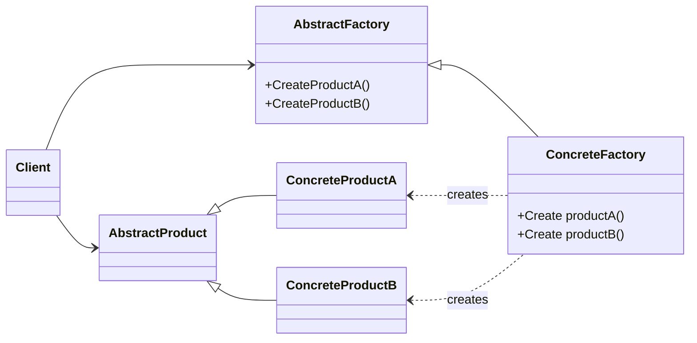
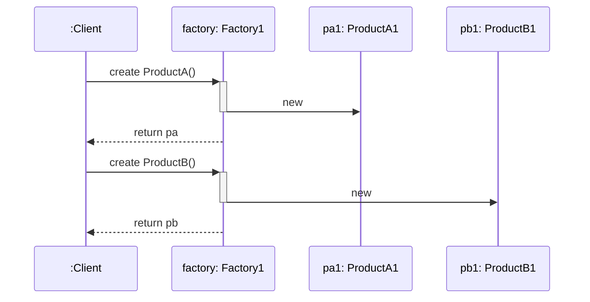
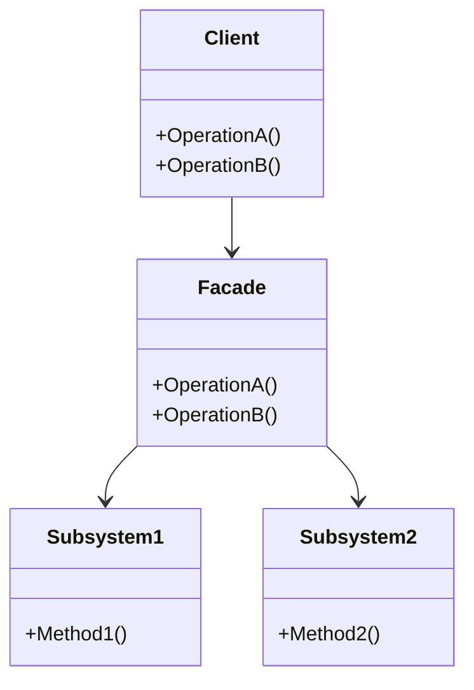
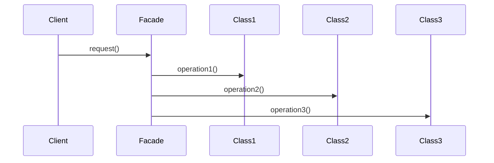
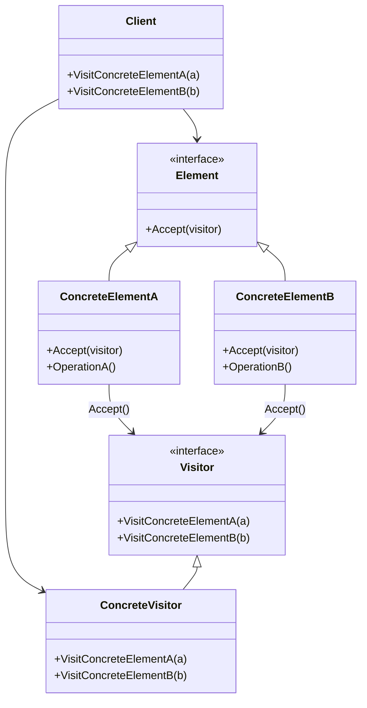
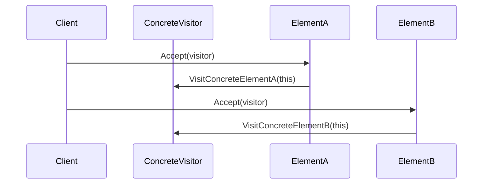
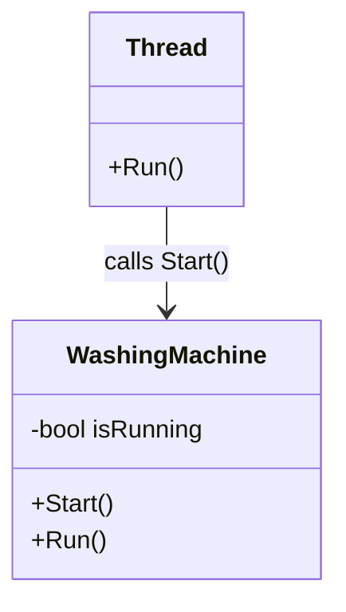
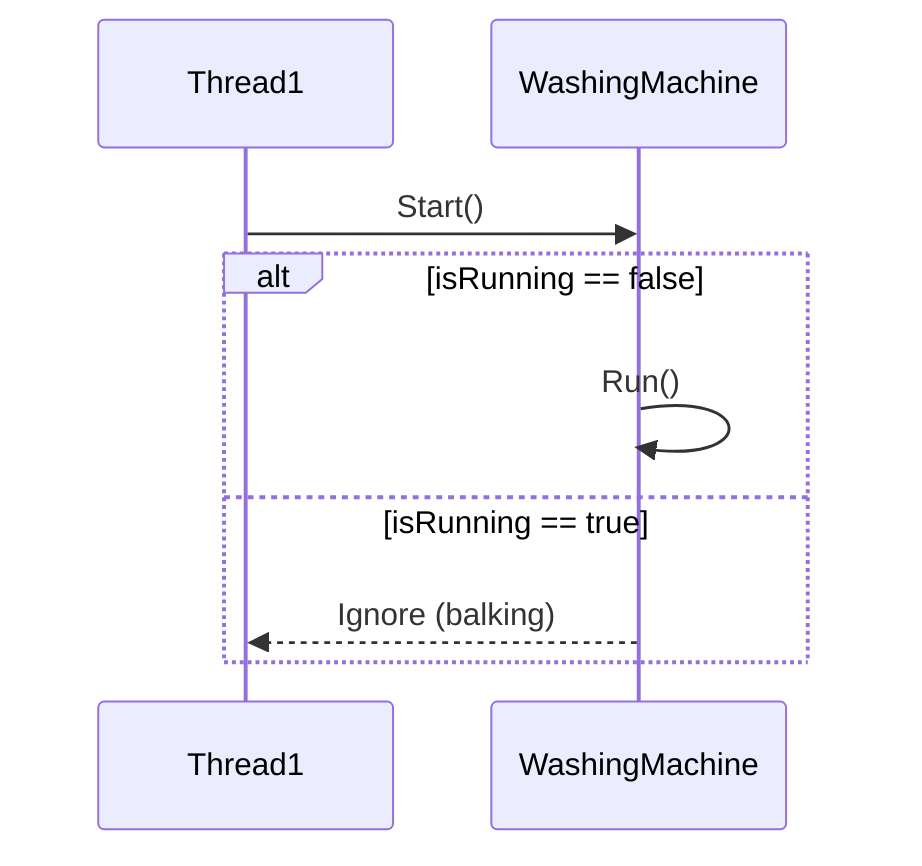

# design-patterns

# Патерн Abstract Factory

## Опис

**Abstract Factory** — це шаблон проєктування, який дозволяє створювати родини пов’язаних або залежних об’єктів без прив’язки до конкретних класів. Інакше кажучи, він інкапсулює створення групи взаємопов’язаних продуктів, щоб клієнтський код міг їх використовувати, не знаючи їх конкретних реалізацій.

Цей підхід ідеально підходить, коли в системі має бути забезпечена взаємозамінність груп об’єктів та дотримання принципу **відкритості/закритості** (*Open/Closed Principle*).

## Структура

- **AbstractFactory** — інтерфейс для створення абстрактних продуктів.
- **ConcreteFactory** — реалізація фабрики, яка створює конкретні продукти.
- **AbstractProduct** — інтерфейс для абстрактного продукту.
- **ConcreteProduct** — реалізація продукту.
- **Client** — використовує тільки інтерфейси, не залежить від конкретних класів.

## Переваги

- Ізоляція конкретних класів
- Забезпечує узгодженість продуктів
- Дотримується принципу інверсії залежностей

## Недоліки

- Додаткове ускладнення коду через велику кількість інтерфейсів та класів
- Важче додавати нові продукти в уже наявну фабрику

# Патерн Facade

## Опис

**Facade** —  це структурний патерн, який надає простий (але урізаний) інтерфейс до складної системи об’єктів, бібліотеки або фреймворку.

## Структура

- **Facade** — клас, який надає простий інтерфейс до складної підсистеми. Делегує запити до відповідних об’єктів підсистем.
- **Subsystem classes (підсистема)** — кілька класів, які реалізують складну логіку. Вони не знають про існування фасаду і працюють самостійно.
- **Client** — використовує Facade для спрощеного доступу до функціоналу всієї підсистеми.

## Переваги

- Ізолює клієнтів від компонентів складної підсистеми

## Недоліки

- Фасад ризикує стати "божественим" об’єктом, прив’язаним до всіх класів програми

  

# Патерн Visitor

## Опис

**Visitor** — це поведінковий патерн, який дозволяє додати нову операцію для цілої ієрархії класів, не змінюючи код цих класів.

## Структура

- **Visitor** — інтерфейс або абстрактний клас, що оголошує методи Visit() для кожного типу елементів.
- **ConcreteVisitor** — реалізує конкретні операції для кожного типу елементів.
- **Element** — інтерфейс або абстрактний клас для об’єктів, які приймають відвідувача (Accept(visitor)).
- **ConcreteElement** — реалізує Accept(visitor) і викликає відповідний метод у відвідувача.
- **Client** — 	ініціює відвідування об’єктів.

## Переваги

- Спрощує додавання операцій, працюючих зі складними структурами об’єктів
- Об’єднує споріднені операції в одному класі
- Відвідувач може накопичувати стан при обході структури елементів

## Недоліки

- Патерн невиправданий, якщо ієрархія елементів часто змінюється
- Може призвести до порушення інкапсуляції елементів

# Патерн Balking

## Опис

**Balking** — Патерн Balking використовується, коли об’єкт має певний стан, і операцію можна виконати лише якщо цей стан дозволяє це.

Якщо поточний стан невідповідний — операція ігнорується (або повертає одразу).

## Структура

- **Context (GuardedObject)** — об'єкт, над яким викликається операція.
- **Thread** — 	потік, який викликає метод.
- **Balking check** — перевірка стану перед виконанням.
- **Lock** — синхронізація, щоб уникнути race condition.

