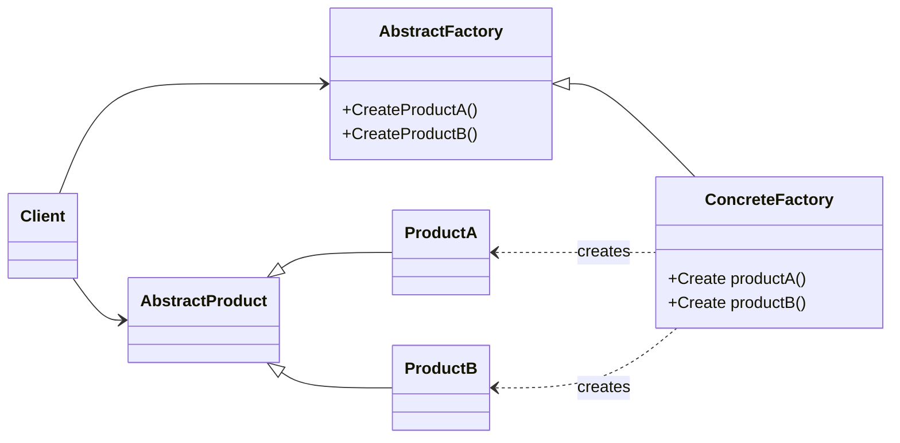

# design-patterns

# Патерн Abstract Factory

## Опис

**Abstract Factory** — це шаблон проєктування, який дозволяє створювати родини пов’язаних або залежних об’єктів без прив’язки до конкретних класів. Інакше кажучи, він інкапсулює створення групи взаємопов’язаних продуктів, щоб клієнтський код міг їх використовувати, не знаючи їх конкретних реалізацій.

Цей підхід ідеально підходить, коли в системі має бути забезпечена взаємозамінність груп об’єктів та дотримання принципу **відкритості/закритості** (*Open/Closed Principle*).

## Структура

- **AbstractFactory** — інтерфейс для створення абстрактних продуктів.
- **ConcreteFactory** — реалізація фабрики, яка створює конкретні продукти.
- **AbstractProduct** — інтерфейс для абстрактного продукту.
- **ConcreteProduct** — реалізація продукту.
- **Client** — використовує тільки інтерфейси, не залежить від конкретних класів.

## Переваги

- Ізоляція конкретних класів
- Забезпечує узгодженість продуктів
- Дотримується принципу інверсії залежностей

## Недоліки

- Додаткове ускладнення коду через велику кількість інтерфейсів та класів
- Важче додавати нові продукти в уже наявну фабрику

